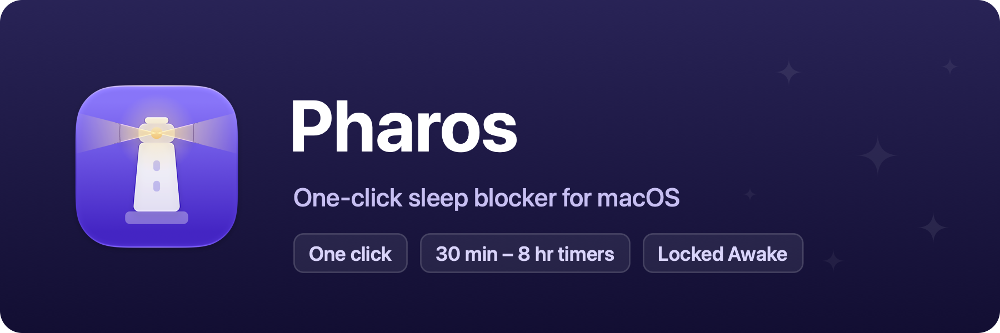

<p align="center">
  
</p>

<p align="center">
  A one-click sleep blocker for macOS, keep the Mac awake through downloads, builds, and presentations.<br />
  A single dependency-free Swift Package, builds with the <code>swift</code> CLI alone, no Xcode project required.
</p>

## What it does

Pharos holds an IOKit power assertion (the same public API `caffeinate` uses) while active, so
the Mac won't go to idle sleep, through long downloads, builds, presentations, or reading.
Keeping the Mac awake needs no permissions, no entitlements, no private frameworks; if the
process dies, the assertion dies with it, so the Mac can never get stuck awake.

- **Left-click** the menu bar beacon to toggle. The icon fills while active.
- **Right-click** (or ⌃-click) for the menu: a **Keep Awake For** timer (30 minutes to
  8 hours, with an "Off in …" countdown), **Lock Screen & Keep Awake**, Settings, and Quit.
- By default the display is kept awake too, a dark, locked screen looks asleep even when
  the system isn't. Turning **Also keep the display awake** off switches to the
  system-sleep-only assertion, letting the display dim and lock while the Mac stays awake.
  Flipping it takes effect immediately, even while active.

## Locked Awake

**Lock Screen & Keep Awake** (in the right-click menu) is for stepping away while background
work, an AI session, a long build, keeps running: every display is covered in black, keyboard
shortcuts and typing are swallowed, and the Mac stays awake behind the cover. Press Return or
click anywhere, then unlock with Touch ID or your account password (the standard system
prompt).

This is the one Pharos feature that needs a permission: swallowing shortcuts like ⌘Tab
requires an event tap, which macOS gates behind **Privacy & Security › Accessibility**. Pharos
asks the first time you lock, and everything else works without it.

> [!IMPORTANT]
> Locked Awake is a privacy barrier against casual physical access, **not a security
> boundary**. It cannot stop someone who can run commands on the machine (`pkill Pharos`
> harmlessly drops the cover), post synthetic events through the Accessibility API, or reach
> the Mac remotely. When real security matters, lock the session (⌃⌘Q) instead, Pharos keeps
> the Mac awake behind the real lock screen too.

## Settings

Open from the right-click menu → **Settings…** (a System Settings–style sidebar window).

- **General**: launch at login, start keeping the Mac awake at launch, also keep the display
  awake, and hide the menu bar icon.

With the menu bar icon hidden, Pharos runs fully invisible. It appears in the Dock only while
the settings window is open, and launching Pharos again while it's running reopens Settings.

> [!NOTE]
> Launch at login requires the bundled app (`SMAppService` needs an app bundle). Settings live
> in UserDefaults, so `swift run` (non-bundled) and `build/Pharos.app` use separate domains and
> don't share them.

## Building the app

```sh
./Scripts/bundle.sh
open build/Pharos.app
```

No permission prompts, Pharos needs none. The app icon is compiled from the Icon Composer
document at `Assets/AppIcon.icon` (generated by `swift Scripts/make-assets.swift`), so on
macOS 26+ the system renders it live with the Liquid Glass treatment, including the dark,
clear, and tinted variants.

## Development

```sh
swift run                    # run once
./Scripts/dev.sh             # rebuild & relaunch on source changes
./Scripts/dev.sh --settings  # same, with the settings window open
```

### Manual test checklist

1. `swift run` → the beacon icon appears in the menu bar.
2. Left-click it: the icon fills, and `pmset -g assertions` lists
   `PreventUserIdleSystemSleep` named "Pharos is keeping the Mac awake".
3. Left-click again: the assertion disappears from `pmset -g assertions`.
4. Right-click → **Keep Awake For** → 30 Minutes: the menu now shows "Off in 30 min",
   counting down on each open.
5. Toggle **Also keep the display awake** in Settings while active: the assertion in
   `pmset -g assertions` switches to `PreventUserIdleDisplaySleep` without a gap.
6. Quit: the assertion is released (`pmset -g assertions` is clean).

### Unit tests

```sh
./Scripts/test.sh   # equivalent to `swift test`
```

The countdown formatting (`AwakeCountdown.remainingLabel`), the duration presets, and the
assertion-type selection are pure logic, covered in `Tests/PharosTests/`: hour/minute
composition, round-up-never-zero, and the display/system assertion mapping. Swift Testing
needs full Xcode, Command Line Tools alone won't run it.

## Code structure

```
Sources/Pharos/
├── main.swift            # Entry point (accessory app, no Dock icon)
├── AppDelegate.swift     # Status item (click = toggle, right-click = menu), timer wiring
├── SleepGuard.swift      # IOPMAssertion wrapper (the actual sleep prevention)
├── AwakeDuration.swift   # Timer presets + countdown formatting (pure, testable)
├── AppPreferences.swift  # App-level preferences
└── SettingsWindow.swift  # Sidebar settings window
```

Recommended reading order: `SleepGuard.swift` → `AppDelegate.setAwake`.

## Roadmap

- **Automatic activation rules** (while an app is running, while on AC power, while a
  display is connected).
- **Release workflow** (GitHub Actions signing + notarization, same shape as Oriel's).

## License

MIT, see [LICENSE](LICENSE). Bundled third-party software and its licenses are listed in [THIRD-PARTY-NOTICES.md](THIRD-PARTY-NOTICES.md).
